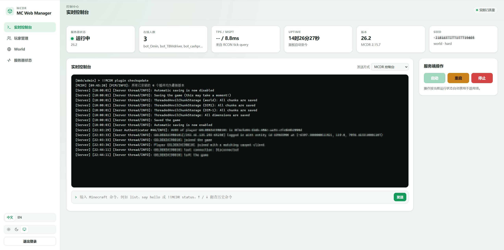
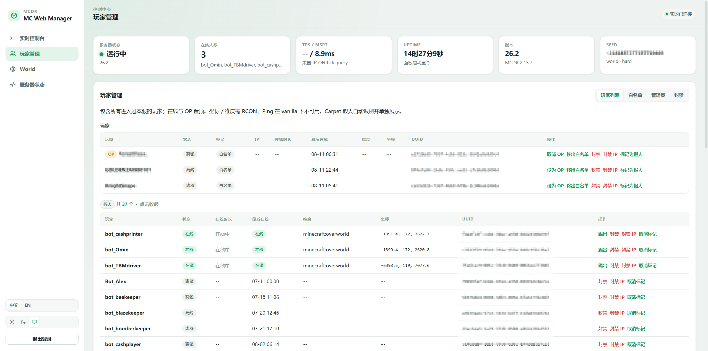
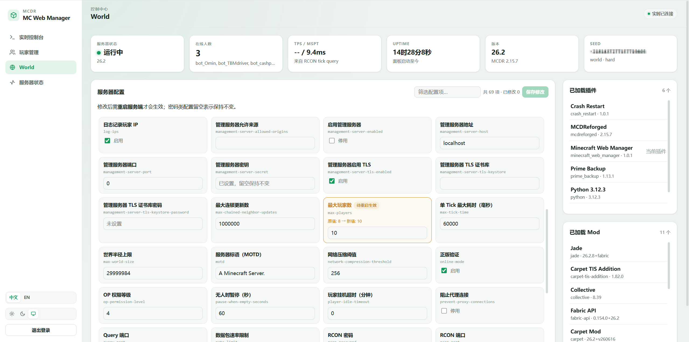
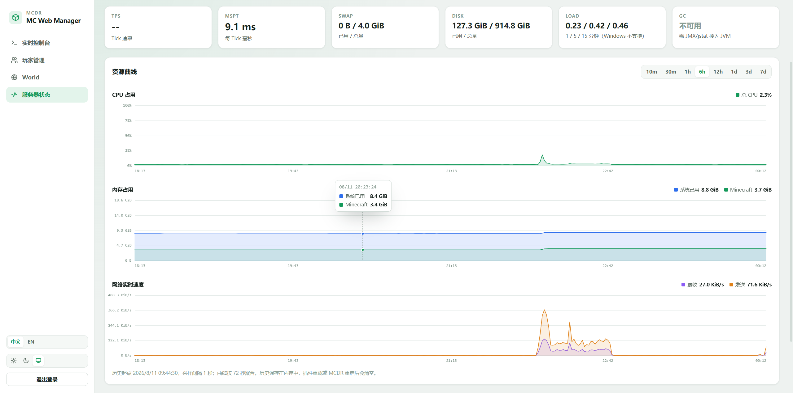

# Minecraft Web Manager

**English** | [中文](README.md)

An [MCDReforged](https://github.com/Fallen-Breath/MCDReforged) plugin that serves a password-protected web dashboard for your Minecraft server: a live console, player management, an online `server.properties` editor and resource usage charts.

The dashboard is hosted by the plugin itself — no separate web server, no CDN, no frontend build step.

- **Version**: 1.0.1
- **Requires**: MCDReforged `>=2.15.0`, Python 3.10+
- **Python packages**: `fastapi`, `uvicorn[standard]`, `psutil`

---

## Features

### Live console

- Server output and in-game chat streamed over WebSocket; the last 1000 lines are replayed on (re)connect
- Send both Minecraft commands and MCDR commands (`!!` prefix) — replies to things like `!!MCDR status` show up in the web console too
- Choose the command channel: **console** (writes to the server's stdin) or **RCON** (returns the server's reply text)
- `↑` / `↓` browse command history; suggestions appear as you type
- One-click start / stop / restart of the server
- Always-visible overview strip: run state, player count, TPS/MSPT, uptime, Minecraft and MCDR versions, world name and seed



### Player management

- **Roster**: every player that has ever joined, merged from `usercache.json`, `ops.json`, `whitelist.json`, the ban lists and player save files — showing online state, IP, session length, last seen, dimension, coordinates and UUID. Online players and operators are pinned to the top. Detected Carpet fake players (bots) live in a separate "Bot management" table inside the same tab, collapsible and manually flaggable per row; the bot table is trimmed to player, status, session, last seen, dimension, position, UUID and actions (no IP/tags columns)
- Per-player actions: op / deop, kick, ban, ban IP, add to / remove from whitelist
- **Whitelist**: toggle enforcement, reload the list, add and remove entries
- **Operators**: view, grant and revoke OP
- **Bans**: ban and pardon players and IPs, with an optional reason



### World

- **Server settings**: view and edit `server.properties` in the browser. Settings render as a responsive card grid with localized labels, enumerated settings (difficulty, gamemode, …) appear as dropdowns, the list is filterable, and the toolbar shows the total and modified counts; saving rewrites only the keys you changed, comments and ordering are preserved, and modified cards are highlighted. Changes saved but not yet applied are marked "pending restart" with the original and new values (sensitive keys only show a "changed" hint, never the value); tracking survives plugin reloads and manual config edits, and clears automatically once the server restarts
- **Loaded plugins / Loaded mods**: live in an always-visible right sidebar (no scrolling to the bottom). Plugins can be reloaded individually; mods are read from `fabric.mod.json` in the server's `mods/` folder



### Server status

- TPS, MSPT, swap, disk and system load at a glance
- Line charts for CPU usage, memory usage and live network throughput, over 10m / 30m / 1h / 6h / 12h / 1d / 3d / 7d
- Whole-host and Minecraft-process series are plotted separately. Samples are kept at 1-second resolution for the last hour and as 1-minute averages for the last 7 days



### Other

- Light / dark / follow-system themes, remembered across visits
- UI language follows the browser automatically (Simplified / Traditional Chinese → Chinese, anything else → English), with a manual switcher on both pages that is remembered
- Responsive layout that works on a phone browser

---

## Installation

### 1. One-command install

```
!!MCDR plugin install minecraft_web_manager
```

### 2. Plugin management

See the official MCDReforged documentation: https://docs.mcdreforged.com/en/latest/command/mcdr.html#plugin-management

### 3. Grab the bootstrap password

On first load the plugin generates a one-time password and prints it to the MCDR log at `WARNING` level:

```
[Minecraft Web Manager] Minecraft Web Manager bootstrap password: xxxxxxxxxxxxxxxxxxxxxxxx
```

**Save it right away** — this is the only time it appears in plain text. Then open:

```
http://127.0.0.1:8088
```

The default username is `admin`; the password is the string above.

### 4. Forgot the password

Set both `password.salt` and `password.hash` to empty strings:

```json
"password": { "salt": "", "hash": "" }
```

Save, then run `!!MCDR reload plugin minecraft_web_manager` — a fresh one-time password is printed to the MCDR log again.

---

## Configuration

The config file lives at `config/minecraft_web_manager/config.json` inside MCDR's working directory. **Reload the plugin for changes to take effect.**

| Key | Default | Description |
| --- | --- | --- |
| `host` | `127.0.0.1` | Listen address. Local-only by default; set `0.0.0.0` to reach it from other machines |
| `port` | `8088` | Listen port |
| `username` | `admin` | Login username |
| `password.salt` / `password.hash` | generated | PBKDF2 salt and hash. The password itself is never stored |
| `token_secret` | generated | Signing key for login tokens. Clearing it invalidates every active session immediately |
| `token_ttl_seconds` | `2592000` (30 days) | Login session lifetime in seconds; sessions slide forward while actively used |
| `panel_title` | `MC Web Manager` | Panel brand title shown in the sidebar and browser tab (the login page title follows) |
| `bot_names` | `[]` | Player names manually flagged as fake players (lowercase); manual fallback on top of auto-detection |
| `not_bot_names` | `[]` | Reverse list (lowercase): forced to be treated as real players even if name rules or the offline UUID match; the per-row "unmark" button writes here |
| `bot_name_patterns` | `["(?i)^bot[_-]"]` | Regex list for bot-like names; by default only applies to players **absent from usercache**, so a real player named `bot_XXX` is not misclassified |
| `bot_name_patterns_apply_to_all` | `false` | Set to `true` to apply name rules to every player (for servers whose fake players do land in usercache); real players with matching names belong in `not_bot_names` |

After login the browser receives an **HttpOnly + SameSite=Strict session cookie** (invisible to page scripts and never sent on cross-site requests), valid for 30 days by default. Active use keeps sliding the expiry forward, so normal usage does not require repeated logins. The "log out" button ends the session immediately; clearing `token_secret` also invalidates every session at once.

---

## About RCON

Most features work without RCON, but these depend on it:

- TPS / MSPT readings (via `tick query`)
- Coordinates and dimension in the player roster
- Seeing command reply text — only the RCON channel returns it
- Recovering the online-player list after a plugin reload

Enabling it requires configuring **both sides** with a matching port and password:

- Minecraft side: `enable-rcon`, `rcon.port` and `rcon.password` in `server/server.properties`
- MCDR side: the `rcon` section of MCDR's `config.yml`

The three Minecraft-side settings can be edited right from the dashboard under **World → 服务器配置** (server settings); the server must be restarted afterwards.

---

## Security notes

The dashboard has full control over your server — arbitrary commands, bans, config changes — so expose it carefully:

- It **listens on `127.0.0.1` by default**. Keeping that and connecting through an SSH tunnel is the safest way to reach it remotely
- If you must expose it publicly, put it behind a reverse proxy such as Nginx or Caddy with HTTPS enabled. The plugin **does not provide TLS**; over plain HTTP your password and token travel in the clear
- The login endpoint has a simple failure throttle (10 attempts per 60 seconds per source) and the interactive API docs are disabled by default; the session cookie is `HttpOnly` with `SameSite=Strict`, so page scripts cannot read the token
- A reverse proxy must forward WebSocket upgrades, otherwise the live console cannot connect:

  ```nginx
  location /ws/ {
      proxy_pass http://127.0.0.1:8088;
      proxy_http_version 1.1;
      proxy_set_header Upgrade $http_upgrade;
      proxy_set_header Connection "upgrade";
  }
  ```

- Sensitive settings such as `rcon.password` are shown blank and never sent to the browser; submitting an empty value leaves them unchanged

---

## Known limitations

- **Resource history is kept in memory**, so it resets to empty whenever MCDR restarts or the plugin is reloaded
- **World seed, name and difficulty are read from save files**, which only update when the server writes them to disk — they can lag reality by minutes
- **Player IPs and UUIDs are parsed from server output**, so unusual log formats may prevent capture. Players recovered after a plugin reload have no join time or IP
- **Only Fabric mods are identified** (via `fabric.mod.json`); Forge / NeoForge mods are listed by filename only
- **Bot detection**: classic Carpet bots are matched by their offline UUID. TIS/AMS/RMS-style extensions may give bots Mojang-resolved or random v4 UUIDs, which only name rules + usercache signals can catch. Name rules only apply to players with no usercache record; use `not_bot_names` or the per-row "unmark" action to force a real-player classification
- **Ping is unavailable on vanilla servers** and therefore not shown
- The dashboard UI currently supports Simplified Chinese and English

---

## Feedback

Issues and suggestions are welcome at [Issues](https://github.com/ForestTrees/MinecraftWebManager/issues).
